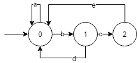

# ProjetFAR

## Sommaire 

## Conception

### Automate

#### Transitions : 

* a : Récupérer les informations de la partie sur DWEET (Reqûete HTTP)

* b : Attendre robot dans la zone de distribution 

* c : Vérifier la présence du ballon sur le terrain

* d : Ballon déjà présent 

* e : Scanner la puce RFID

* f  : Affecter le ballon encrypt à un robot

* g : Attendre la requête du *Validateur de but*

* h : Vérifier la validité du ballon

* i  : Ballon invalide

* j  : Ballon valide

* k : Relancer

####Etats :

  ​