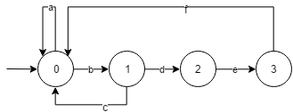

# FAR - Automates : Rendu 1

#### Binôme  

* Kévin Hassan
* Yves-Alain Agbodjogbe

#### Rôle 

* Distributeur de ballon

#### Groupe TD 

* 1

#Conception

## Automates

#### Automate Distribution du ballon

##### Transitions

* a :  Attendre le robot dans la zone de distribution
* b :  Demander le ballon (Requête HTTP vers le **Serveur Central**)
* c :  Recevoir une réponse négative (tous les ballons sont déjà sur le terrain)
* d :  Recevoir une réponse positive et scanner la puce RFID
* e  :  Affecter le ballon encrypté au robot
* f :  Relancer l'attente en zone de distribution

##### Etats

- 0 :  Attente robot zone
- 1 :  Présence ballon
- 2 :  Robot identifié
- 3 :  Balle passée

#### Automate Vérification but valide

##### Transitions

- a :  Attendre la requête du validateur de but (Requête RPC)
- b :  Vérifier la validité du ballon (Requête HTTP au **serveur central**)
- c :  Envoyer "Ballon valide" au validateur de but
- d :  Envoyer "Ballon non valide" au validateur de but
- e :  Relancer l'attente

##### Etats

- 0 :  Attente but
- 1 :  Analyse ballon
- 2 :  Ballon valide

#### Automate Serveur Central

##### Transitions

- a :  Récupérer les informations sur *DWEET*
- b :  Attendre requête HTTP
- c :  Vérifier Ballon disponible
- d :  Vérifier Ballon valide
- e :  Créer le Ballon en ajoutant le robot propriétaire à la clé 
- f  :  Envoyer la réponse au client avec le Ballon
- g : Ballon non disponible et réponse au client
- h : Envoyer réponse au client (Si valide incrémenter le nombre de ballon disponible)
- i  : Relancer l'attente

##### Etats

- 0 :  Partie démarrée
- 1 :  Attente de communication
- 2 :  Verification disponibilité du ballon
- 3 :  Verification validité du ballon
- 4 :  Ballon créé
- 5 :  Réponse au client